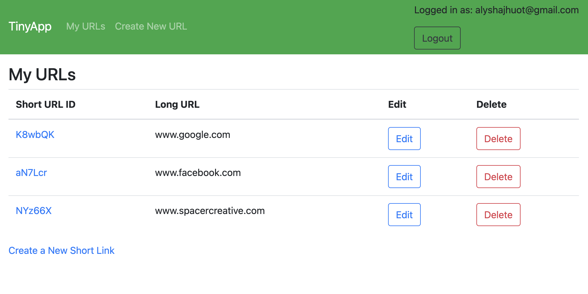
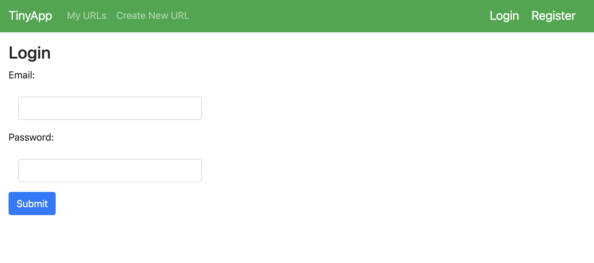

# TinyApp Project

TinyApp is a dynamic full-stack web application, developed using Node.js and Express. It offers users the functionality to shorten lengthy URLs, much like bit.ly, providing a more streamlined and user-friendly way to manage and share web links.

## Final Product

## Dependencies

- Node.js
- Express
- EJS
- bcryptjs
- cookie-session

## Getting Started

- Install all dependencies (using the `npm install` command).
- Run the development web server using the `node express_server.js` command.